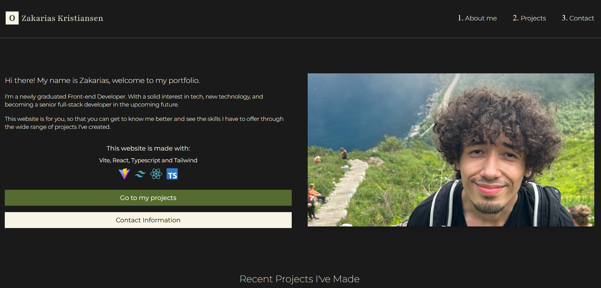

# Zakarias' Portfolio



## Project Overview

This portfolio website showcases my work and skills as a Front-end Developer and aspiring Full-stack Developer. Built using Vite, React, TypeScript, and Tailwind CSS, it's designed to highlight my proficiency in modern web technologies and provide insights into the projects I've worked on.

---

## Website Link

Explore my portfolio here: [ZakariasPortfolio](https://ozkportofolio.netlify.app/)

[](https://app.netlify.com/sites/ozkportofolio/deploys)

---

## Table of Contents

- [Project Overview](#project-overview)
- [Features](#features)
- [Tech Stack](#tech-stack)
- [Getting Started](#getting-started)
  - [Prerequisites](#prerequisites)
  - [Installation](#installation)
- [Running the Project](#running-the-project)
- [Acknowledgments](#acknowledgments)
- [Contact](#contact)

---

## Features

- **Personal Projects Overview**
- **Interactive Resume**
- **Contact Information**
- **Responsive Design for various devices**

---

## Tech Stack

- **Vite** - Front-end build tool enhancing performance and developer experience.
- **React** - JavaScript library for building user interfaces.
- **TypeScript** - Superset of JavaScript for static type checking.
- **Tailwind CSS** - Utility-first CSS framework for rapid UI development.

<span>
  
  
  
  
</span>

---

## Getting Started

### Prerequisites

- Ensure you have **Node.js** and **npm** installed.

### Installation

1. **Clone the repository:**

   ```bash
   git clone https://github.com/oddvarzk/Portfolio.git
   ```

   **Navigate to the project directory:**

   ```bash
   cd Portofolio
   ```

2. **Install dependencies:**

   ```bash
   npm install
   ```

## Running the Project

To start the development server, run:

```bash
npm run dev
```

This will start the app on [http://localhost:3000](http://localhost:3000) or the next available port.

To build the project for production, run:

```bash
npm run build
```

To preview the production build locally, run:

```bash
npm run preview
```

---

## Acknowledgments

- **Noroff School of Technology and Digital Media**
- **Vite**
- **React**
- **Tailwind CSS**
- **Netlify**

---

## Contact

For any inquiries or feedback, please contact:

- **Name:** Oddvar Zakarias Kristiansen
- **Email:** [oddvarzk@gmail.com](mailto:oddvarzk@gmail.com)
- **GitHub:** [oddvarzk](https://github.com/oddvarzk)
- **LinkedIn:** [Oddvar Zakarias Kristiansen](https://www.linkedin.com/in/oddvar-zakarias-kristiansen-22b583262/)

---
